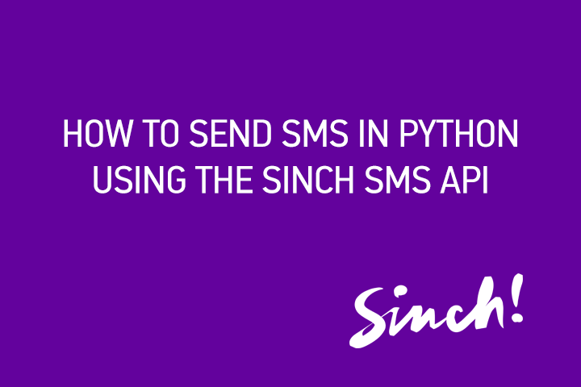

#Sending SMS With Python

In this tutorial, you will use the Python module SinchSMS to [send an SMS message with Sinch](https://www.sinch.com/products/sms-api/ "SMS"). With the Sinch SMS API, you can build anything from a simple notification service to [two-factor authentication](https://www.sinch.com/features/sms-features/two-factor-authentication/ "Two Factor Authentication") solutions.

<iframe width="560" height="315" src="http://www.youtube.com/embed/EKoxLxzWNOk" frameborder="0" allowfullscreen="allowfullscreen"></iframe>

[](http://www.youtube.com/watch?v=EKoxLxzWNOk "Send SMS in Python")

For SMS pricing by destination, visit our [pricing pages](https://www.sinch.com/pricing/sms-prices/ "SMS Prices").

## Setup

1.  Create a [Sinch developer account](www.sinch.com/signup)
2.  In your developer dashboard, click “Apps” in the left-hand menu
3.  Click “Create new app”
4.  Name your app and click “Create”
5.  Take note of your app key and secret, you will need them in a few minutes
6.  Install the module using `pip install sinchsms`

## Sending an SMS via the API

Launch the interactive console by typing `python` in your command line and type the below:

````
import time
from sinchsms import SinchSMS

number = '+yourmobilenumber'
message = 'I love SMS!'

client = SinchSMS(your_app_key, your_app_secret)

print("Sending '%s' to %s" % (message, number))
response = client.send_message(number, message)
message_id = response['MessageId']

response = client.check_status(message_id)
while response['Status'] != 'Successful':
print(response['Status'])
time.sleep(1)
response = client.check_status(message_id)
print(response['Status'])
````

If you don't want to use a module, you can find the source code for the module on GitHub: [https://github.com/sinch/python-sinch-sms](https://github.com/sinch/python-sinch-sms)

### What's next?

In the coming months, we will start supporting incoming SMS and have a packaged solution for verifying phone numbers through SMS and calling. Stay tuned.

### Video

We have also turned this tutorial into a quick video walkthrough. Click on the image below to watch the tutorial.

[](https://www.youtube.com/watch?v=dE-xyeBNAvs)

Happy SMSing!

-[Christian](https://www.sinch.com/author/christian/)
